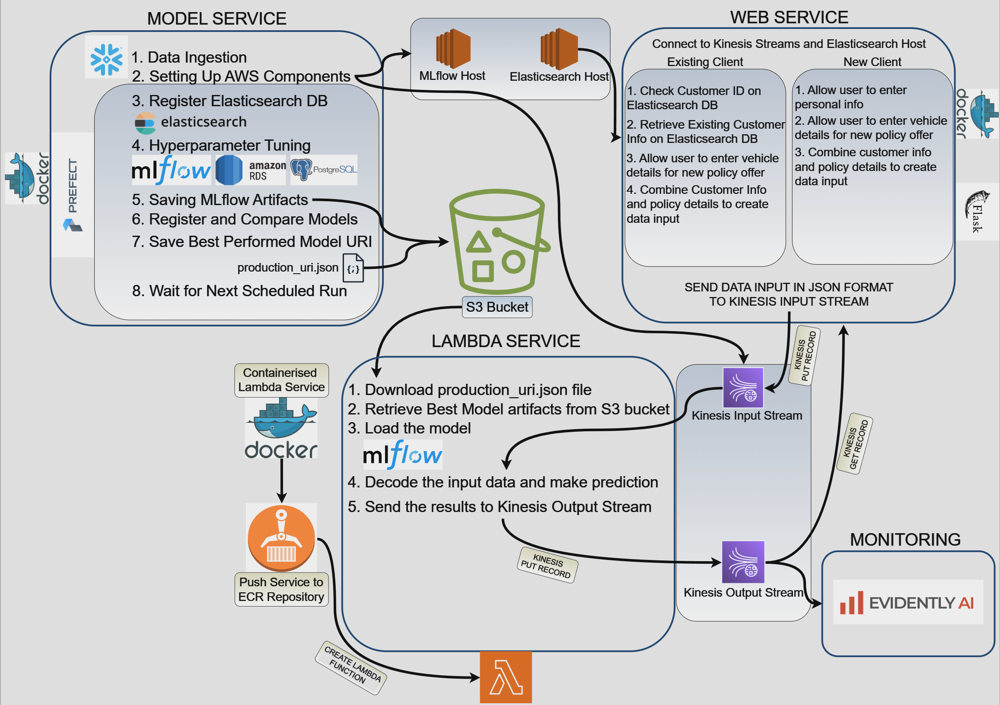
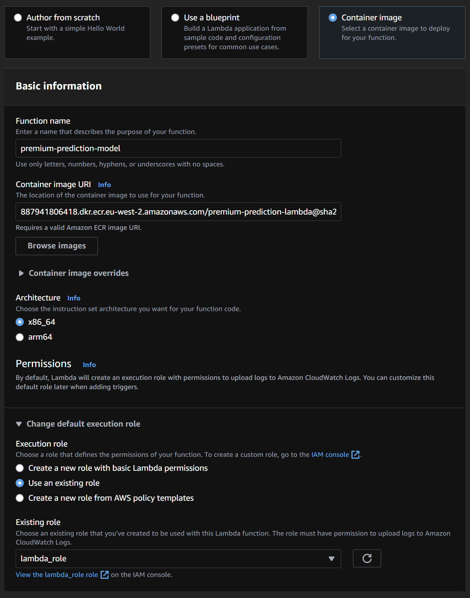
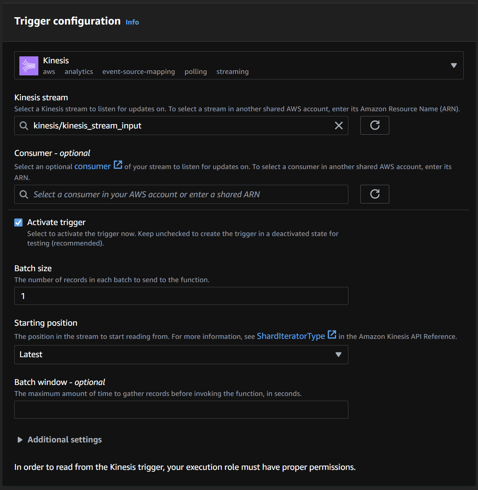

# mlops-webservice-streaming-insurance-premium-prediction
This project aims to predict motor vehicle insurance premiums using a machine learning approach with XGBoost models. The data, initially stored in Snowflake, undergoes preprocessing and feature engineering orchestrated by Prefect. The model training pipeline is containerised and deployed on an EC2 instance, utilising MLflow for hyperparameter optimization and capturing the best model. MLflow and Elasticsearch are hosted on other EC2 instances for robust management and retrieval capabilities. The model artifacts resulting of pipeline running are stored in an S3 Bucket. For the web application component, user inputs are captured through a frontend and backend system. If a user record exists, it is retrieved from Elasticsearch and combined with the input data. This combined data is sent through an AWS Kinesis input stream, triggering AWS Lambda function. The Lambda function, containerized and stored in Amazon Elastic Container Registry, processes the input data with the production XGBoost model where its artifact stored in the S3 to predict the premium amount. The prediction is then sent back through a Kinesis stream output and displayed to the user on the web application.

## Project Structure
``` bash
├── README.md
├── lambda_trial_check.py
├── mlops_build.ipynb
├── test_docker.py
├── run_project.sh
│
├── lambda_service
│   ├── Dockerfile
│   ├── Makefile
│   ├── docker_push.py
│   ├── lambda_function.py
│   └── requirements.txt
│
├── model_service
│   ├── Dockerfile
│   ├── Makefile
│   ├── config.json
│   ├── dataset
│   │   └── data.csv
│   ├── docker_push.py
│   ├── orchestrate.py
│   ├── requirements.txt
│   └── setup_aws.py
│
└── web_service
    ├── Dockerfile
    ├── Makefile
    ├── aws_settings.json
    ├── entry_forms.py
    ├── requirements.txt
    ├── routes.py
    ├── static
    │   └── def.css
    └── templates
        ├── existingc.htm
        ├── index.htm
        ├── newc.htm
        └── premiumoffer.htm
```

## Project Diagram



## Create a Key Pair and Security Groups for EC2 instances that host MLflow and Elasticsearch services

In order to SSH EC2 instances, you need to create a key pair RSA type named exactly `ec2_instance`.

In order to EC2 instances and postgreSQL servers can communicate in between, you need to create two different security groups;

### mlflow

Set the inbound rules:
- `TCP Port 5000, 9200`
- `Port 22 for SSH`

Set the outbound rules:
- `All traffic`

### postgresql

Set the inbound rules:
- `TCP Port 5432, PostgreSQL`
- `All traffic`

Set the outbound rules:
- `All traffic`

Head into `setup_aws.py` file in Line 59, change the value to postqreSQL security group id;

```bash
    self.security_group = ["sg-##########"] ##postqresql security group id
```

## Building and testing Lambda function before getting it ready for containerisation

The file `lambda_trial_check.py` is utilised for development purposes of final lambda function for this project. It works in parallel with web app while checking records every second.

```bash
def lambda_handler():
    response = kinesis.describe_stream(StreamName=STREAM_INPUT_NAME)

    my_shard_id = response['StreamDescription']['Shards'][0]['ShardId']

    shard_iterator_response = kinesis.get_shard_iterator(
    StreamName=STREAM_INPUT_NAME, 
    ShardId=my_shard_id,
    ShardIteratorType='LATEST')

    shard_iterator = shard_iterator_response['ShardIterator']

    # Get records
    while True:
        response = kinesis.get_records(
            ShardIterator=shard_iterator,
            Limit=1
        )

        if response['Records']:
            latest_record = response['Records'][0]
            print("Latest record: ", latest_record)
            break
        else:
            print("No records found, retrying...")
            time.sleep(1)
```

## Create an S3 Bucket manually (AWS CLI or UI) for common use

Initially we need to create an S3 Bucket that lamba, model, web service deployment will utilise and set environment variable `BUCKET_NAME` in your local before using Makefiles.

```bash
export BUCKET_NAME=mlops-project-bucket-v1
echo $BUCKET_NAME
```

## Setting up and running container services locally for testing and finally pushing to ECR

```bash
build:
    docker build --build-arg BUCKET_NAME=${BUCKET_NAME} -t premium-prediction-####:v1 .
```

Running images on your local requires AWS credentials to be passed as environment variables.

```bash
run_local:
	docker run -it \
	-p 8080:8080 \
	-e AWS_ACCESS_KEY_ID="${AWS_ACCESS_KEY_ID}" \
	-e AWS_SECRET_ACCESS_KEY="${AWS_SECRET_ACCESS_KEY}" \
    -e AWS_DEFAULT_REGION="${AWS_DEFAULT_REGION}" \
	premium-prediction-####:v1
```

After all testings are done you can push the image to ECR using corresponding Makefile. 
Make sure that first create an ECR repository `premium-prediction-####` and change variable `DOCKER_REMOTE_URI` in Makefile.

```bash
push:
    DOCKER_REMOTE_URI=$(DOCKER_REMOTE_URI) python3 docker_push.py
```

## Containarise model training and orchestration pipeline

Before building and running `model_deploy`, we need to make sure that all configuration values are set and copied into existing S3 bucket. Training pipeline automatically download config.json file from existing S3 bucket and adjust training configuration with values within the file. This way, without interrupting the running container you can set new variables for training pipeline.

```bash
JSON_FILE := "config.json"
upload_config:
	aws s3 cp $(JSON_FILE) s3://$(BUCKET_NAME)/$(JSON_FILE)
```

To see what is happening in Prefect while pipeline is running, you need to obtain an API key to connect Prefect Cloud server. You can track all running and scheduled flows on Prefect UI. API key is obtained from Prefect Cloud and needs to be specified before running `model_service` container.

```bash
run_local:
	docker run -it \
	-p 4200:4200 \
	-e AWS_ACCESS_KEY_ID="${AWS_ACCESS_KEY_ID}" \
	-e AWS_SECRET_ACCESS_KEY="${AWS_SECRET_ACCESS_KEY}" \
	-e AWS_DEFAULT_REGION="${AWS_DEFAULT_REGION}" \
	-e PREFECT_CLOUD_API_KEY="${PREFECT_CLOUD_API_KEY}" \
	premium-prediction-model:v1
```

## Running Whole Project

Make sure that you create an `S3 Bucket` and an ECR Repository named `premium-prediction-lambda`.

Create `mlflow` and `postgresql` roles. 

Change `setup_aws.py` Line 59 with your `postgresql` Security Group ID.

Then let's run;

```bash
chmod +x run_project.sh
./run_project.sh
```

On Prefect Cloud UI, you can now see scheduled runs of the `model-service-deployment`.

If you don't want to wait first scheduled run, set up a quick run on UI.

In order to have fully worked application, go to AWS console, create a Lambda function using ECR image for `lambda_deploy` and attach the input stream for triggering it.

While creating Lambda function using Container image, make sure that default execution role has full access to S3, Lambda, and Kinesis services. Don't forget to adjust Lambda Memory Capacity and timeout.



To attach Kinesis Input Stream, make sure batch size is 1 and activate trigger option is ticked.



Once the initial deployment run completed and lambda function is created with Kinesis Stream Input attachment, go through a new terminal, head into `web_service` and command `make run_local`

## Optional

Model_service can also be registered to an ECR with the following code after you ensure that the repository `premium-prediction-model` is created.

```bash
export MODEL_REMOTE_URI="aws_account_id.dkr.ecr.region.amazonaws.com/premium-prediction-model"
cd model_service
make push
```
If you're familiar with AWS ECS operations, you can create an ECS Linux task to operate model training service.